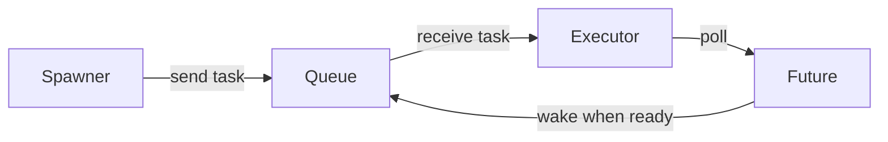
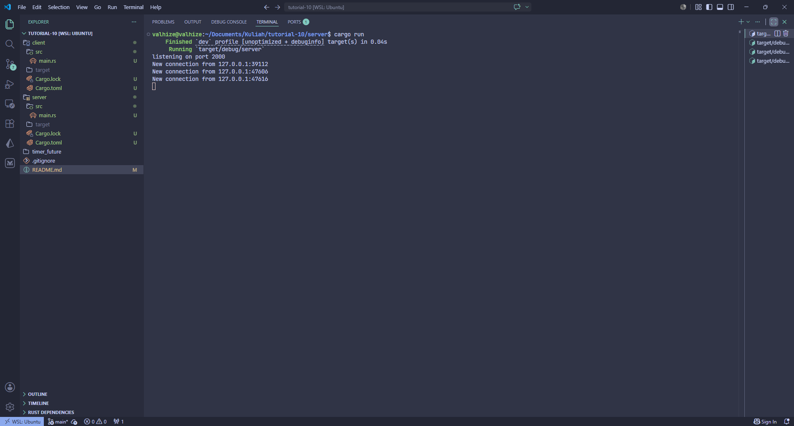
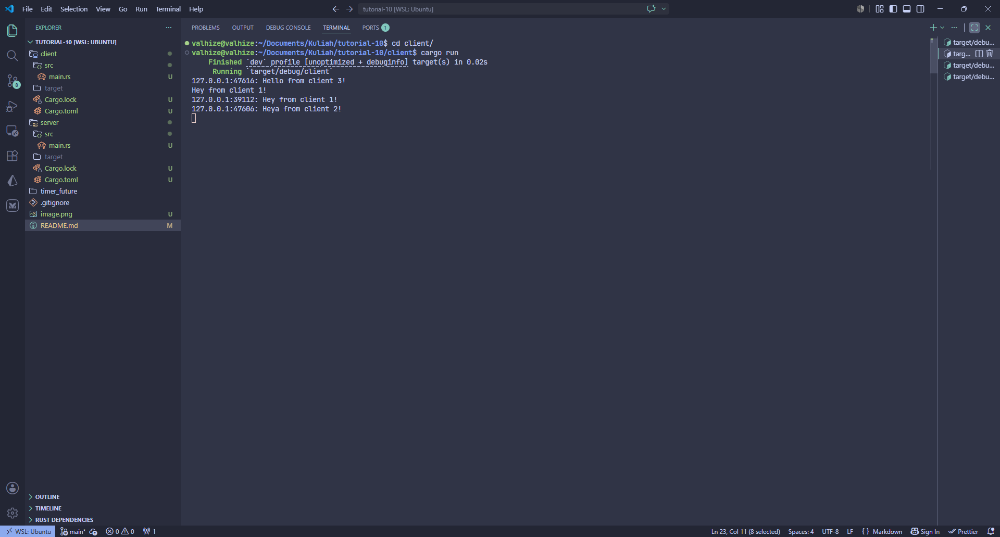
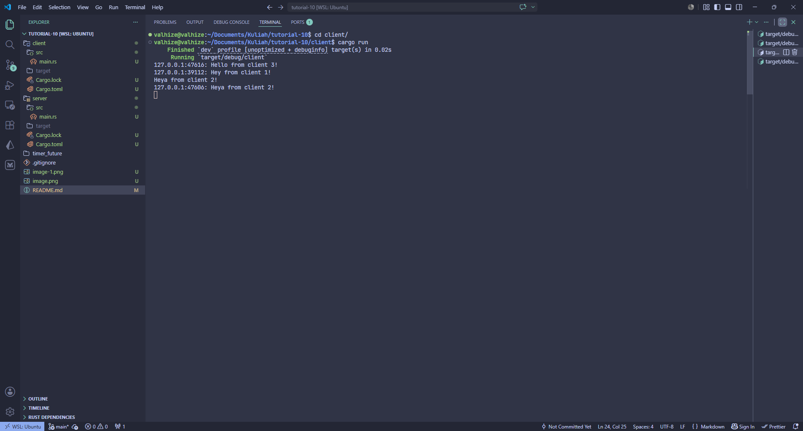

# 1.2

`spawner.spawn()` only *creates* and *queues* the task, not run it. The task runs when `executor.run()` is called. `println!("Val's Computer: hey hey")` is a normal line with nothing special. The line is placed *before* `executor.run()`, that's why it is called first before the spawned task is executed.

# 1.3

As mentioned before, spawn creates and queues a task to run *later*. The executor is used to execute tasks that has been created and queued before.

When commenting out `drop(spawner)`, the program runs indefinitely. That is because the program waits for another spawn, but there are no spawns written anymore. `drop(spawner)` is used to make the executor stop waiting for tasks.

# 2.1

Each time I type in a client, all other client will receive the typed message from the first client. To run it, run the server first, then run all clients.

# 2.2

The program is still using the same WebSocket protocol. The client defines it in `client/src/main.rs` through the URI `ws://127.0.0.1:8080`, where the `ws://` scheme means the connection uses the WebSocket protocol.

On the server, the protocol is handled in `server/src/main.rs`. The server first listens on `127.0.0.1:8080`, then `ServerBuilder::new().accept(socket).await?` upgrades the accepted TCP connection into a WebSocket stream.
